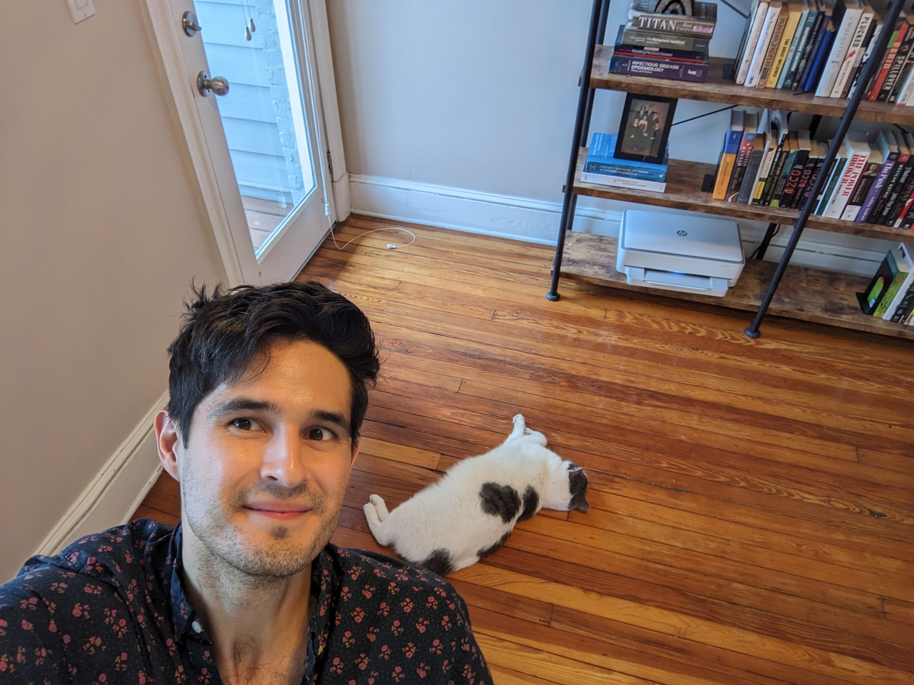

I'm a researcher working at the intersection of machine learning
and software engineering. I currently work as a staff software 
engineer in Google's DevAI team, where we build machine learning
systems to make Google developers more productive.

Previously, I was a
senior researcher on the [PROSE team at Microsoft](https://www.microsoft.com/en-us/research/group/prose/),
where I worked on developing state-of-the-art program synthesis technologies to make software development
more accessible, productive, and fun.

I received a PhD in 
Computer Science (CS) from MIT under the supervision of Martin Rinard, an MS
in CS from NYU working with Dennis Shasha, and a BA in Economics from
University of Pennsylvania. I'm originally from Costa Rica.

For a recent version of my CV, see [here](static/cambronero-cv.pdf)

You can reach me at:

- josepablocam@gmail.com
- \@josepablocam (twitter)

# Random blog posts

* [statement of purpose](blogs/statement_of_purpose.html)

# Publications

---
bibliography: publications.bib
nocite: "@*"
csl: simple.csl
---
